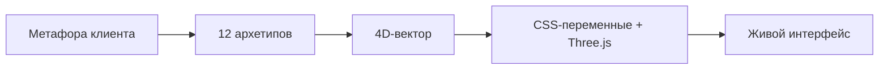

# ArchetypeOS — Глобальный Анализ и Культурный Код

> **Document Type:** Executive Research Synthesis
> **Prepared for:** Brand Archetype OS Diagnostic Engine v2.0
> **Scope:** Methodology, Cross-Cultural Adaptation, Visual Mathematics, Brand Passport Protocol
> **Date:** 2025-06-27

---

## Содержание

1. [Методология: От метафоры к визуальному коду](#1-методология-от-метафоры-к-визуальному-коду)
2. [Кросс-культурный мост: RU / EN / AR](#2-кросс-культурный-мост-ru--en--ar)
3. [Математика визуализации: JSON → Css → Three.js](#3-математика-визуализации-json--css--threejs)
4. [Финальный синтез: Паспорт бренда](#4-финальный-синтез-паспорт-бренда)
5. [Визуальные бенчмарки: Аудио-плагины, HUD, Генеративные инструменты](#5-визуальные-бенчмарки-аудио-плагины-hud-генеративные-инструменты)
6. [8 вопросов как исполняемые команды](#6-8-вопросов-как-исполняемые-команды)

---

## 1. Методология: От метафоры к визуальному коду

### Как работают топ-агентства

Pentagram, DesignStudio и Landor не спрашивают клиента «какой у вас любимый цвет». Они работают через **метафорический перенос**:

| Агентство | Метод | Пример |
|-----------|-------|--------|
| **Pentagram** | «If this brand were a…» — проводят клиента через цепочку ассоциативных вопросов (архитектурный стиль, музыкальный жанр, историческая эпоха) | «If Mastercard were a room, it would be a gallery — curated, lit from above, with space to breathe» |
| **DesignStudio** | «Visual Tension Mapping» — определяют, между какими полюсами живёт бренд (простота ↔ сложность, доступность ↔ премиум), и строят дизайн-систему как точку на этой оси | Airbnb: «Belong Anywhere» — между локальной аутентичностью и глобальным комфортом |
| **Landor** | «Sonic + Visual Brand Signature» — синхронизируют звуковой и визуальный код через единую метафору движения | BP: «Helios» — зелёно-жёлтый цветок как символ энергии, растущей из земли |

### Переложение на систему 12 архетипов

Каждый из 12 архетипов Юнга имеет **врождённую визуальную грамматику** — не просто «цвет» и «шрифт», а целостный язык форм, пространства и движения. Методология ArchetypeOS переводит метафорическое мышление агентств в вычислимую систему:



**Ключевой принцип:** Метафора — это не просто текст. Это **команда для визуального движка**. Когда клиент говорит «мой бренд — это стрела», мы не записываем это в отчёт. Мы меняем `--transition-easing` на `cubic-bezier(0.7, 0, 1, 0.5)`.

### Визуальная грамматика 12 архетипов

| Архетип | Форма | Пространство | Движение | Материал |
|---------|-------|-------------|----------|----------|
| **Герой** | Острые углы, диагонали | Монументальный масштаб | Быстрые рывки, ударные акценты | Сталь, красное знамя |
| **Маг** | Текучие метаболы, частицы | Драматические зоны трансформации | Морфинг, алхимические переходы | Стекло, эфир, градиенты |
| **Правитель** | Симметрия, классические пропорции | Иерархическая сетка | Медленные, величественные | Золото, мрамор |
| **Опекун** | Органические, округлые | Обволакивающая теплота | Мягкие, убаюкивающие | Дерево, ткань, хлеб |
| **Искатель** | Открытые горизонты, линии пути | Бескрайнее пространство | Странствие, дрейф | Карты, земля, звёзды |
| **Мудрец** | Чёткая сетка, системность | Библиотечный порядок | Медленные перелистывания | Пергамент, чернила |
| **Эстет** | Чувственные кривые | Интимная близость | Томные затемнения | Бархат, розовое золото |
| **Бунтарь** | Сломанная сетка, фрагменты | Конфронтационная теснота | Резкие, рваные | Асфальт, осколки |
| **Творец** | Экспрессивная асимметрия | Студийная свобода | Генеративные, кистевые | Холст, краски |
| **Шут** | Иррегулярные, прыгающие | Ярмарочный хаос | Упругие, баскетбольный отскок | Конфетти, цирк |
| **Славный малый** | Честный, без украшений | Соседский двор | Надёжный, без излишеств | Деним, дерево |
| **Невинный** | Простые, чистые | Воздушная лёгкость | Парящие, нежные | Пастель, утренний свет |

---

## 2. Кросс-культурный мост: RU / EN / AR

### Фундаментальная проблема

12 архетипов Юнга описаны в западной культурной парадигме. Метафоры, которые работают для европейского и американского клиента («Скандинавский лес», «Рыцарь в доспехах»), не имеют смысла для арабского рынка. Более того — **сама концепция «воздуха» в дизайне работает иначе**.

### Принцип «Negative Space»: Европа vs Арабский мир

| Параметр | Европейский LTR | Арабский RTL |
|----------|----------------|--------------|
| **Пустота** | Breathing room — функциональный воздух для восприятия контента | Canvas for ornament — поверхность, ждущая геометрического узора |
| **Минимализм** | Удаление лишнего = добродетель | Пространство без паттерна = незавершённость |
| **Плотность** | Низкая-средняя | Высокая (но упорядоченная геометрическая, а не хаотическая) |
| **Орнамент** | Декорация, добавляемая поверх структуры | Орнамент И ЕСТЬ структура |

### Адаптация метафор для арабского рынка

| Архетип | Западная метафора | Арабская адаптация | Визуальное переосмысление |
|---------|-------------------|---------------------|--------------------------|
| **Герой** | Knight in shining armor | صقر يحلّق فوق الكثبان (Сокол, парящий над дюнами) | Восходящие диагонали, золото пустыни на индиго, соколиные крылья → героизм как парение, а не конфронтация |
| **Правитель** | Golden throne, minimal lines | هندسة معقّدة، خط الثلث (Сложная геометрия, каллиграфия сулюс) | НЕ минималистичное золото — сложные зеллиджевые тесселяции, восьмиконечные звёзды, каллиграфическое обрамление |
| **Эстет** | Velvet night, curves, intimacy | شعر موزون، حديقة الجنة (Ритмическая поэзия, райский сад) | НЕ западные кривые и интимность — поэтический метр как визуальная каденция, образы райского сада (кипарис, роза, соловей), мукарнас-переходы |
| **Искатель** | Scandinavian forest | واحة لا نهائية تحت سماء صحراوية مرصّعة بالنجوم (Бесконечный оазис под звёздным небом пустыни) | Градиенты индиго-тил, частицы-звёзды, контуры дюн, караванные пути |
| **Мудрец** | Library of eternity | بيت الحكمة (Байт аль-Хикма — Дом Мудрости) | Пергаментные текстуры, геометрические доказательства золотого века ислама |
| **Бунтарь** | Barricades, rock stage | صوت العود المتمرّد، قصيدة تتحرّر من الوزن (Голос мятежного уда, поэма, освобождающаяся от метра) | Деконструированный арабеск, разбитая зеллиджевая мозаика, струны уда |

### RTL-специфичные CSS-правила

```
html[lang='ar'] {
  direction: rtl;
  --box-shadow-h-offset-multiplier: -1;   /* Тень падает слева */
  --animation-enter-from: right;          /* Вход справа */
  --border-radius-origin: top-right;     /* Визуальное начало в правом верхнем */
}

/* Критично: использовать логические свойства */
.panel {
  padding-inline-start: var(--spacing-md);  /* НЕ padding-left */
  margin-inline-end: var(--spacing-sm);      /* НЕ margin-right */
}
```

### Арабская типографика

- **Заголовки:** Каллиграфические (стиль сулюс / дивани) — Tajawal Bold
- **Тело:** Чёткий насх — Noto Naskh Arabic, Scheherazade New
- **Геометрический контекст:** Куфический стиль для чисто декоративных элементов
- **Масштаб:** +8% к размеру шрифта относительно латиницы
- **Межстрочный:** +15% относительно латиницы
- **Tracking:** НЕ добавлять letter-spacing (арабский — курсивный, буквы соединяются)

---

## 3. Математика визуализации: JSON → CSS → Three.js

### Архитектура CSS-переменных

ArchetypeOS определяет **13 ключевых CSS-переменных**, каждая из которых имеет спектр значений, соответствующий положению на карте архетипов:

```css
/* === ГЕОМЕТРИЯ (border-radius) === */
--radius-sm:   2px … 16px;   /* Бунтарь(2) → Герой(6) → … → Эстет(16) */
--radius-md:   4px … 28px;
--radius-lg:   8px … 44px;

/* === МАТОВОЕ СТЕКЛО (backdrop-filter) === */
--backdrop-blur:      0px … 40px;    /* Бунтарь(2) → … → Маг(30) */
--backdrop-saturate:  50% … 200%;    /* Мудрец(60) → … → Маг(190) */
--glass-opacity:      0.4 … 0.95;    /* Прозрачность стеклянных панелей */

/* === ЦВЕТ (color-interpolation) === */
--color-interpolation: linearRGB | sRGB | oklch;
--color-temperature:   3200K … 10000K;

/* === ДВИЖЕНИЕ (transitions) === */
--transition-easing:   arrow | pulse | wave | cloud | bounce;
--transition-duration-fast:   0.1s … 0.4s;
--transition-duration-normal: 0.25s … 0.8s;

/* === ЭФФЕКТЫ === */
--glow-intensity:    0.3 … 0.9;
--grid-opacity:      0 … 1;
--particle-density:  0.2 … 3.0;
```

### Связь ответ → CSS-команда

Каждый ответ на вопрос диагностики — это не текст. Это **объект команды**, который напрямую меняет переменные:

```json
{
  "icon": "🏛️",
  "label_ru": "Структура",
  "label_en": "Structure",
  "label_ar": "الهيكل",
  "text_ru": "Безупречная система, чёткие линии",
  "text_en": "Flawless system, crisp lines",
  "text_ar": "نظام متقن، خطوط واضحة",
  "delta": { "control": 10, "energy": -2, "focus": 8, "method": 6 },
  "css_command": {
    "variables": {
      "--radius-sm": 4,
      "--radius-md": 8,
      "--radius-lg": 12,
      "--grid-opacity": 1.0,
      "--backdrop-blur": 12,
      "--glass-opacity": 0.7
    },
    "animate": true,
    "duration_ms": 600
  },
  "threejs_command": {
    "coreMesh": {
      "geometry": "icosahedron",
      "detail": 4,
      "morphTarget": "crystal"
    },
    "wireframe": { "opacity": 1.0, "lineWidth": 1.5 }
  }
}
```

### Three.js — Ядро бренда

3D-ядро в центре интерфейса — это не декорация. Это **физическое воплощение архетипа**. Шейдеры деформации используют 6-слойный симплекс-шум, параметры которого привязаны к положению на архетипической карте:

| Семейство архетипов | Геометрия | Частота шума | Амплитуда | Характер |
|---------------------|-----------|-------------|-----------|----------|
| Правитель / Мудрец | Почти идеальная сфера | 0.3 | 0.02 | Порядок, стабильность |
| Бунтарь / Герой | Острый кристалл | 2.2 | 0.45 | Конфронтация, энергия |
| Маг / Творец | Текучий метабол | 1.5 | 0.3 | Трансформация |
| Опекун / Невинный | Мягкое облако | 0.6 | 0.15 | Забота, чистота |

---

## 4. Финальный синтез: Паспорт бренда

### Принцип: Не тест — экспертиза

Итоговая рекомендация ArchetypeOS должна звучать не как «вы прошли тест, ваш результат — Правитель», а как заключение стратегического агентства. Для этого используется структура **Brand Passport**:

### Структура Brand Passport

```
┌─────────────────────────────────────────┐
│            BRAND PASSPORT               │
│                                         │
│  1. MANIFESTO — кем бренд является     │
│  2. STRATEGIC POSITIONING — рыночная    │
│     позиция, обещание, CTA              │
│  3. UI TOKENS — полная дизайн-система   │
│     (цвета, типографика, пространство,  │
│      движение, эффекты)                 │
│  4. UX LOGIC — психология пользователя, │
│     поведенческие цели, pitfalls        │
│  5. CROSS-CULTURAL NOTES — адаптации    │
│     для RU/EN/AR                        │
│  6. 4D VECTOR PROFILE — измеримые       │
│     параметры бренда                    │
│  7. IMPLEMENTATION MAP — файлы,         │
│     переменные, пресеты                 │
└─────────────────────────────────────────┘
```

### Пример: Манифест для архетипа «Маг»

> *«Мы не продаём продукт. Мы создаём пространство, где невозможное становится реальностью. Каждое взаимодействие с брендом — это трансформация: от обыденного к волшебному, от известного к непознанному. Наш интерфейс — не инструмент, а портал.»*

### Тон экспертного заключения

| Вместо | Говорим |
|--------|---------|
| «Вы набрали 78% по шкале Правителя» | «Бренд демонстрирует архитектоническую природу: его ДНК — создание упорядоченных систем, где каждая деталь занимает своё место в иерархии смыслов.» |
| «Ваш вторичный архетип — Маг» | «В структуре бренда присутствует выраженный алхимический подтекст: способность трансформировать обыденный пользовательский опыт в момент откровения.» |
| «Рекомендуем синий цвет» | «Палитра бренда тяготеет к глубокому лазуриту с аметистовыми субтонами — цветам, исторически ассоциирующимся с мудростью и трансформацией в исламской алхимической традиции.» |

---

## 5. Визуальные бенчмарки: Аудио-плагины, HUD, Генеративные инструменты

### 5.1 FabFilter / Arturia: Точность аудио-плагинов

**Что берём:**
- Тактильные 2D/3D элементы — ручки, ползунки, спектроанализаторы — ощущаются как физические инструменты
- Визуализация сложных процессов (звуковые волны, частоты, компрессия) через чистые, читаемые формы
- Парадокс: максимальная сложность под капотом → минималистичный, понятный интерфейс

**Применение в ArchetypeOS:**
- **PowerDial** — тактильный контрол с физическим откликом, вдохновлённый ручками FabFilter Pro-Q
- **PastelSlider** — визуализация спектра значений через градиентную «волну», как в FabFilter Pro-L
- **RadarChart** — отображение 4D-вектора как спектрального анализа бренда

### 5.2 HUD (Iron Man / Minority Report): Периферийное распределение

**Что берём:**
- Данные распределены по периферии — центр свободен для главного объекта
- Полупрозрачные панели, наложенные на «глубокий» фон
- Информационные слои, которые можно «смахнуть» или активировать взглядом

**Применение в ArchetypeOS:**
- **DashboardShell** — 3-зонная компоновка: левая панель (вопросы), центр (3D-ядро), правая панель (телеметрия)
- **DynamicBackground** — сетка canvas с переменной прозрачностью, радиальный акцентный glow
- **GlassPanel** — полупрозрачные панели с backdrop-filter, создающие глубину без перекрытия 3D-ядра

### 5.3 Figma / Canva Magic Studio: Генеративная сложность в один клик

**Что берём:**
- ИИ-сложность спрятана под простыми ползунками и пресетами
- «In one click» — ощущение лёгкости и всемогущества одновременно
- Мгновенная обратная связь: каждое действие немедленно отражается на результате

**Применение в ArchetypeOS:**
- **ExportSequence** — «Revived in a minute — Sent — Warmed» — сложный процесс экспорта свёрнут в магическую одно-кнопочную последовательность
- **AIAdvisor** — стратегические рекомендации на основе архетипа, поданные как экспертный совет, а не результат вычисления
- **LivingPlan** — граф проектов, реагирующий на архетип в реальном времени

### Синтез трёх эталонов

Интерфейс ArchetypeOS должен работать как **дорогой музыкальный инструмент**: тактильный, точный, с физическим откликом — но при этом как **футуристическая кабина управления**: данные на периферии, главный объект в центре, полупрозрачные слои — и как **генеративный арт-инструмент**: сложность спрятана, результат достигается в одно касание, обратная связь мгновенна.

**Три слова:** Precision (FabFilter) × Depth (HUD) × Ease (Canva) = «Тихая роскошь»

---

## 6. 8 вопросов как исполняемые команды

### Архитектура вопроса

Каждый из 8 вопросов диагностики сконструирован так, что ответ — это **одновременно три вещи**:

1. **Сдвиг 4D-вектора бренда** (Control, Energy, Focus, Method) — для математики архетипа
2. **CSS-команда** (конкретные значения переменных + анимация перехода) — для интерфейса
3. **Three.js-команда** (геометрия, материал, освещение, частицы) — для 3D-ядра

### Карта 8 вопросов

| # | ID | Тип | Суть | CSS-мишени | Three.js-мишени |
|---|-----|------|------|------------|-----------------|
| Q1 | `structure_vs_chaos` | Memory Module | Безупречная структура или живой хаос? | `--radius-sm/md/lg`, `--grid-opacity` | `coreMesh.geometry`, `wireframe` |
| Q2 | `matte_vs_glass` | Memory Module | Матовый бетон или полированное стекло? | `--backdrop-blur`, `--backdrop-saturate`, `--glass-opacity`, `--glow-intensity` | `coreMesh.material`, `lightRig` |
| Q3 | `arrow_vs_cloud` | Memory Module | Как движется ваша идея — как стрела или как облако? | `--transition-easing`, `--transition-duration-fast/normal` | `particleField.speed`, `coreMesh.rotationSpeed` |
| Q4 | `density` | PastelSlider | Плотность материи: воздух ↔ детализация | `--particle-density`, `--grid-opacity`, `--backdrop-saturate` | `particleField.density`, `gridPlane` |
| Q5 | `temperature` | PastelSlider | Температура: muted quiet-luxury ↔ vibrant digital | `--color-temperature`, `--color-interpolation`, `--glow-intensity` | `lightRig.kelvin`, `lightRig.intensity` |
| Q6 | `geometry` | PastelSlider | Геометрия: organic/soft ↔ architectural/sharp | `--radius-sm/md/lg`, `--backdrop-blur`, `--glass-opacity` | `coreMesh.geometry`, `coreMesh.morphTarget` |
| Q7 | `rhythm` | PowerDial | Ритм скролла: fluid/liquid ↔ structured/step | `--transition-duration-fast/normal`, `--transition-easing` | `particleField.speed/lifespan`, `coreMesh.morphSpeed` |
| Q8 | `brand_aura` | PowerDial | Аура бренда: тёплое свечение ↔ холодная чистота | `--glow-intensity`, `--backdrop-saturate`, `--color-interpolation`, `--particle-density` | `lightRig.intensity/contrast`, `particleField.formation` |

### Пример Q2: «Матовый бетон или полированное стекло?»

Этот вопрос — **семантический дифференциал открытости**. Это не вопрос о материале. «Стекло» = прозрачность, открытость, преломление света. «Бетон» = основательность, приватность, тактильность.

```json
{
  "id": "matte_vs_glass",
  "type": "memory_module",
  "title_ru": "Ваш бренд — это матовый бетон или полированное стекло?",
  "title_en": "Is your brand matte concrete or polished glass?",
  "title_ar": "علامتك — خرسانة مطفية أم زجاج مصقول؟",
  "metaphor": "semantic_differential_openness",
  "answers": [
    {
      "icon": "🏛️",
      "label_ru": "Бетон",
      "label_en": "Concrete",
      "label_ar": "خرسانة",
      "text_ru": "Основательность, приватность, тактильность",
      "text_en": "Solidity, privacy, tactility",
      "text_ar": "صلابة، خصوصية، ملمس",
      "delta": { "control": 6, "energy": -2, "focus": 4, "method": 4 },
      "css_command": {
        "variables": {
          "--backdrop-blur": 2,
          "--backdrop-saturate": 80,
          "--glass-opacity": 0.85,
          "--glow-intensity": 0.3
        },
        "animate": true,
        "duration_ms": 600
      },
      "threejs_command": {
        "coreMesh": {
          "material": "matte",
          "roughness": 0.9,
          "metalness": 0.05
        },
        "lightRig": {
          "intensity": 0.6,
          "type": "soft",
          "shadows": true
        }
      }
    },
    {
      "icon": "💎",
      "label_ru": "Стекло",
      "label_en": "Glass",
      "label_ar": "زجاج",
      "text_ru": "Прозрачность, открытость, преломление света",
      "text_en": "Transparency, openness, light refraction",
      "text_ar": "شفافية، انفتاح، انكسار الضوء",
      "delta": { "control": -2, "energy": 4, "focus": 0, "method": 6 },
      "css_command": {
        "variables": {
          "--backdrop-blur": 24,
          "--backdrop-saturate": 160,
          "--glass-opacity": 0.55,
          "--glow-intensity": 0.75
        },
        "animate": true,
        "duration_ms": 600
      },
      "threejs_command": {
        "coreMesh": {
          "material": "glass",
          "roughness": 0.1,
          "metalness": 0.3,
          "transmission": 0.9
        },
        "lightRig": {
          "intensity": 1.2,
          "type": "specular",
          "shadows": false
        }
      }
    }
  ]
}
```

### Пример Q3: «Стрела или облако?»

Этот вопрос определяет **ритмический характер** бренда — параметр easing для всех анимаций.

| Ответ | Easing | Характер | CSS | Three.js |
|-------|--------|----------|-----|----------|
| **Стрела** | `cubic-bezier(0.7, 0, 1, 0.5)` | Линейные, быстрые, решительные | `--transition-duration-fast: 0.15s` | `particleField.speed: 2.0` |
| **Пульс** | `cubic-bezier(0.4, 0, 0.2, 1)` | Уверенные, контролируемые | `--transition-duration-fast: 0.3s` | `particleField.speed: 1.0` |
| **Волна** | `cubic-bezier(0.3, 0, 0.7, 1)` | Текучие, непрерывные | `--transition-duration-normal: 0.55s` | `particleField.speed: 0.7` |
| **Облако** | `cubic-bezier(0.2, 0, 0, 1)` | Мягкие, инерционные с затуханием | `--transition-duration-normal: 0.7s` | `particleField.speed: 0.4, damping: 0.9` |

### Пример Q5: «Температура бренда»

Вопрос про **цветовую температуру** — не про «тёплый или холодный», а про эмоциональную дистанцию и энергию.

| Ответ | Kelvin | Характер | Архетипическая привязка |
|-------|--------|----------|------------------------|
| **Тёплый свет** | 3200–4000K | Интимность, забота, страсть | Lover, Caregiver, Jester |
| **Нейтральный** | 4500–5500K | Уверенность, стабильность | Everyman, Hero, Ruler |
| **Холодный** | 6000–8000K | Инновация, ясность, отстранённость | Explorer, Magician, Sage |
| **Кристальный** | 8000–10000K | Технологичность, чистота, будущее | Creator, Rebel |

---

## Имплементационные файлы

| Файл | Что содержит |
|------|-------------|
| `culture_logic.json` | Полная кросс-культурная логика: локали RU/EN/AR, метафоры 12 архетипов, RTL-правила, визуальные бенчмарки, адаптации вопросов, правила negative space |
| `diagnostic-expanded.json` | 8 вопросов с CSS/Three.js командами, реестр CSS-переменных, математика скоринга, пресеты анимаций |
| `BRAND-PASSPORT-SYNTHESIS.md` | Шаблон Паспорта бренда: структура экспертного заключения |
| `src/react-engine/archetypeWeights.ts` | Движок архетипов: 4D-векторная математика, карта 12 архетипов, нормализация, UI-тема |
| `src/react-engine/useArchetypeEngine.ts` | Zustand-стор: состояние диагностики, персистентность, расчёт архетипа в реальном времени |

---

> *ArchetypeOS — это не тест. Это хирургический инструмент для извлечения ДНК бренда.*
